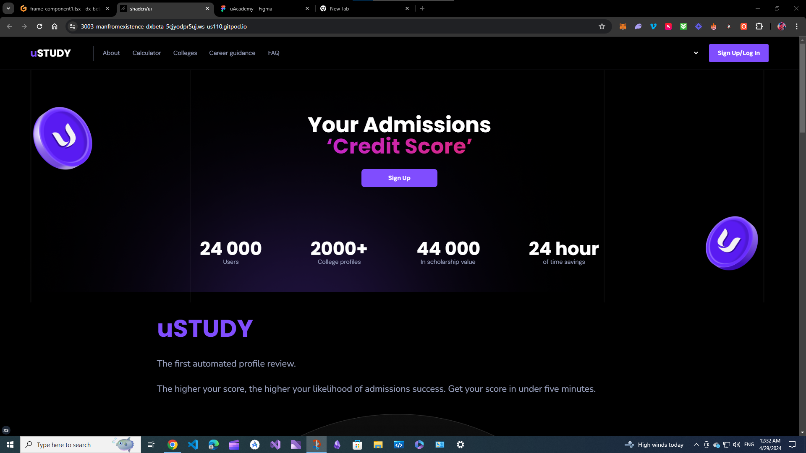

<!-- # shadcn/ui

Accessible and customizable components that you can copy and paste into your apps. Free. Open Source. **Use this to build your own component library**.


## Documentation

Visit http://ui.shadcn.com/docs to view the documentation.

## Contributing

Please read the [contributing guide](/CONTRIBUTING.md).

## License

Licensed under the [MIT license](https://github.com/shadcn/ui/blob/main/LICENSE.md). -->


<p align="center">
  <a href="https://dx.vercel.app">
    
    <h3 align="center">Ustudy</h3>
  </a>
</p>

<p align="center">


---

# Project Description: Web App Development for Android App

## Overview
Nurzhol Tabigat, the client behind **minialgo.kz**, seeks to enhance their existing Android app by creating a complementary web app. The goal is to provide users with a seamless experience across both platforms. The project involves building a front-end web app and an admin panel that manages universities, specialties, and testing questions.

  <a href="https://dx.vercel.app">
    
    <h3 align="center">Landing Page</h3>
  </a>
</p>
## Project Scope
1. **Front-End Web App**:
   - Develop a responsive web application that mirrors the functionality of the existing Android app.
   - Ensure compatibility with various browsers and devices.
   - Implement the "landing page" section based on the provided Figma design.
   - Use modern web technologies (HTML, CSS, JavaScript) to create an intuitive user interface.

2. **Admin Panel**:
   - Design and build an admin panel accessible via a secure login.
   - Admin panel features:
     - Add universities: Allow administrators to add, edit, or delete university information.
     - Manage specialties: Enable administrators to maintain a list of academic specialties.
     - Create testing questions: Provide an interface for adding and organizing questions for both the web app and mobile app.

3. **Integration with Firebase**:
   - Utilize Firebase for real-time data synchronization between the Android app and the web app.
   - Ensure seamless communication between the two platforms.

## Budget and Timeline
- **Budget**: The client has allocated a budget of **$20** for this project.
- **Timeline**: The project must be completed within **1-2 days**.

## Technical Details
- **Stack**: The project will be built using the following technologies:
  - **Front-End**: HTML, CSS, JavaScript
  - **Back-End (Admin Panel)**: Node.js (Express or similar)
  - **Database**: Firebase (for data synchronization)
  - **Package Manager**: **pnpm**

## Deliverables
1. **Web App Codebase**:
   - The entire front-end codebase for the web app.
   - Organized directory structure.
   - Clean, well-documented code.

2. **Admin Panel Codebase**:
   - The back-end codebase for the admin panel.
   - API endpoints for managing universities, specialties, and testing questions.

3. **GitHub Repository**:
   - Create a GitHub repository to host the project.
   - Include a README file with instructions for running the web app locally.

## Additional Notes
- The client has attached the mobile app for reference.
- The Figma design for the "landing page" section is also provided.

---

Certainly! Below is a detailed **README** for building the web app project using **pnpm**. Follow these steps to set up and run the project:

---

# Web App Project: Setup and Build Instructions

## Prerequisites
Before you begin, ensure that you have the following installed on your system:

1. **Node.js**: Make sure you have Node.js installed. If not, download it from the official website.

2. **pnpm**: We'll use `pnpm` as our package manager. If you don't have it installed, run the following command to install it globally:

    ```bash
    npm install -g pnpm
    ```

## Getting Started
1. **Have the code**:
   - can get from Upwork

     ```bash
     just download the zip from there
     ```

2. **Navigate to the Project Directory**:
   - Change into the project directory:

     ```bash
     cd minialgo-web-app
     ```

3. **Install Dependencies**:
   - Install project dependencies using `pnpm`:

     ```bash
     pnpm install
     ```

4. **Configuration**:
   - Create a `.env` file in the root directory with the necessary environment variables. For example:

     ```env
     FIREBASE_API_KEY=your_api_key_here
     FIREBASE_AUTH_DOMAIN=your_auth_domain_here
     # Add other Firebase config variables as needed
     ```

5. **Run the Development Server**:
   - Start the development server:

     ```bash
     pnpm dev
     ```

6. **Access the Web App**:
   - Open your browser and visit http://localhost:3000.

## Admin Panel
1. **Admin Panel Routes**:
   - Access the admin panel at http://localhost:3000/admin.

2. **Login Credentials**:
   - Use the provided login credentials to access the admin panel:
     - Username: `admin`
     - Password: `admin123`

## Deployment
1. **Build for Production**:
   - To build the project for production, run:

     ```bash
     pnpm build
     ```

2. **Serve the Production Build**:
   - Serve the optimized production build:

     ```bash
     pnpm start
     ```

3. **Access the Deployed Web App**:
   - Visit http://localhost:3000 to see the deployed web app.

## Questions or Issues?
If you encounter any issues or have questions, feel free to reach out to me. Happy coding! 🚀

---

<!-- **Project Repository**: AL-ASTER/minialgo-web-app -->

*Note: Replace the Firebase configuration variables in the `.env` file with your actual Firebase credentials.*

