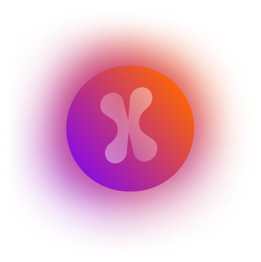

<p align="center">
  <a href="https://dx.vercel.app">
    
    <h3 align="center">Dx</h3>
  </a>
</p>

<p align="center">
  Develop. Preview. Share.
</p>

<p align="center">
  <a href="https://dx.vercel.app/docs"><strong>Documentation</strong></a> ·
  <a href="https://dx.vercel.app/changelog"><strong>Changelog</strong></a> ·
  <a href="https://dx.vercel.app/templates"><strong>Templates</strong></a> ·
  <a href="https://dx.vercel.app/docs/cli"><strong>CLI</strong></a>
</p>
<br/>

## What is it?
 Developing experience or delightfull expreince.

## Documentation
For details on how to use Dx, check out our [documentation](https://dx.vercel.app/docs).

## Microservices new final folders list:
  | List | Folder |
  | --- | -------- |
  | 1   | ai |
  | 2   | algorithm |
  | 3   | backend |
  | 4   | benchmark |
  | 5   | blockchain |
  | 6   | cloud |
  | 7   | config |
  | 8   | database |
  | 9   | design-pattern |
  | 10  | documentation |
  | 11  | external |
  | 12  | frontend |
  | 13  | infrastucture |
  | 14  | internal |
  | 15  | media |
  | 16  | observability |
  | 17  | package |
  | 18  | platform |
  | 19  | privacy |
  | 20  | roadmap |
  | 21  | script |
  | 22  | generator |
  | 23  | test |
  | 24  | tool |
  | 25  | theory |
  | 26  | auth |
  | 27  | ui |
  | 28  | ux |
  | 29  | workspace |
  | 30  | cybersecurity |

# Motivation
Dx has used many other opensource github repoes in it.This is not waste of time cause that repoes are fetced automaticlly by Terminalflow and this repoes is used probably in the best way possible by maintaing their copyrights after their repective owners.I used other repoes cause Dx aims to do a lot of things besides + up + down and every way around WWW INTERNET stuffts(not native cause that problem has its own solution guess the unique name would be,,,okay okay.. donot bottheer -> DX Native -I know such a uniqe name "I know I am best at naming stuffs" [And I am too lazy so donot expect me to put logo or link to that website here do it by yourself(Ninja Tecnic For Rankning Searh In Google Search --- and I beg you please go to Dx Native ignoring my bad joke)]).
And many things are already maded by cool programmers.I can make it but it will littery take me months doing so.Most imporatant thing is that I donot like to build the wheel again and again in this way nothing is going to be better cause we donot live
forever.But if you thing that this is unfair then look up to
inspirations
folder and delete your respective reposetry to gain access to your own products!!!
So, moral of this story no.. of this descritption.. I mean Novel stated above is --- OpenSource conrtibution is good for your health(Donot ask me how??)
and Dx is one of the most precious one amoung them!!!(LOL)
How to Steall || LOL Just kidding!!! || Anything made by me in exitence plus (any+every)thing in not exitstencev like doesnot exits like now But will exit... Later!!! like me yeah... yeah yeeah me BeingOfExistence is public and free to use anywhere!!! || Just put (BeingOfExistence => Pleaaases pretty pleasaase!!!) logo in that software or anddd...  in exitence plus (any+every)thing in not exitstencev like doesnot exits like now But will exit... Later!!!!!

## `manfromexistence/dx -> Getting Started`
<details>
<summary>So, dx by default uses new blazing fast bun runtime but you can also use npm,yarn and pnpm if you want plus some important github repos that you really want to chech yourself!</summary>
material-color-utilities 
```
git clone https://github.com/material-foundation/material-color-utilities.git colors && cd colors && rm -rf .git && cd ..
```

tailwindcss 
```
git clone https://github.com/tailwindlabs/tailwindcss.git && cd tailwindcss && rm -rf .git
```

sass 
```
git clone https://github.com/sass/sass.git && cd sass && rm -rf .git && cd ..
```

shadcn-ui 
```
git clone https://github.com/shadcn-ui/ui.git && cd ui && rm -rf .git && cd .. 
```

```sh
bun
```
start the development server

```sh
bun run dev
```
build with production mode

```sh
bun turbo run build --filter=aptos-web
# start the application after build
apps/web/.next
````
</details>

<details>
<summary>How to start</summary>

```sh
bun
````

start the development server

```sh
bun dev
```
build with production mode

```sh
bun build
bun start
```
</details>

<details>
  <summary>How to Run</summary>

  ```sh
  bun run dev
  ```

  ```sh
  bun turbo run build --filter=aptos-web
  ```
</details>

<details>
  <summary>Databses</summary>
  French = Bonjour, here is the information in a table format:

  | List | Database |
  | --- | -------- |
  | 1   | Mysql |
  | 2   | Postgresql |
  | 3   | Mongodb |
  | 4   | Redis |
  | 5   | Planetscale + Pocketbase |
  | 6   | Yugabyte |
  | 7   | Neon |
  | 8   | Dolt + Gun |
  | 9   | Cockrockdb |
  | 10  | CloudFlared1 |
  | 11  | Xata |
  | 12  | 8base |
  | 13  | Edgedb |
  | 14  | Surrealdb |
  | 15  | Fuana |
  | 16  | Memgraph |
  | 17  | Keydb |
  | 18  | Meilisearch + Algoria |
  | 19  | Mindsdb |
  | 20  | Casandra + Hasura |
  | 21  | Neo4j |
  | 22  | Firebase |
  | 23  | Dynomodb(amplify) |
  | 24  | Superbase |
  | 25  | Nhost + Appwrite |
</details>

<details>
  <summary>Web3</summary>
  German = Hallo, here is the information in a table format:

  | List | Provider |
  | --- | ---- |
  | 1   | Moralis |
  | 2   | Thirdweb |
  | 3   | Quicknode + Alchemy + Metaplex |
</details>

<details>
  <summary>(Componets) -> i think scripts are playing an important role in the connection of components and components library has</summary>
  Italian = Ciao, here is the information in a table format:

  | Things | Logic |
  | --- | ---- |
  | 1   | types |
  | 2   | varients |
  | 3   | forwardRef |
  | 4   | interfaces |
</details>

<details>
  <summary>(Cli) -> and about cli it is optained based</summary>
  Arabic = مرحبا (Marhaba), here is the information in a table format:

  | Things | Logic |
  | --- | ---- |
  | 1   | node_modules = have no benefits |
  | 2   | src path or custom path = looks good but should be more resusable |
</details>

<details>
  <summary>(Online Code Editors) -> This thing will be used at docs and my and also be my inspirations in making a code editor</summary>
  Spanish = Hola, here is the information in a table format:

  | List | Editor |
  | --- | ---- |
  | 1   | Gitpod |
  | 2   | Visual Studio Code(app + browser) |
  | 3   | Codesandbox |
  | 4   | Stackblitz |
  | 5   | CodePen |
  | 6   | JSFiddle |
  | 7   | JS Bin |
  | 8   | AWS Cloud9 |
</details>

<details>
  <summary>React UI Frameworks</summary>
  here is the information in a table format:

| Rank | Library              | Github Stars |
|------|----------------------|--------------|
| 1    | Material UI (MUI)    | 78.5k        |
| 2    | Ant Design (AntD)    | 77.2k        |
| 3    | Chakra UI            | 47.9k        |
| 4    | React Bootstrap      | 45.3k        |
| 5    | Blueprint            | 19.7k        |
| 6    | Grommet              | 17.6k        |
| 7    | Rebass               | 17.3k        |
| 8    | Semantic UI React    | 17k          |
| 9    | Evergreen            | 16.8k        |
| 10   | Mantine              | 16.6k        |
| 11   | NextUI               | 15.5k        |
| 12   | Theme UI             | 13.8k        |
| 13   | Retool               | 12.2k        |
| 14   | PrimeReact           | 11.7k        |
| 15   | Fluent UI            | 11k          |
| 16   | VisX                 | 10.8k        |
| 17   | Headless UI          | 10.7k        |
| 18   | React Suite          | 10.3k        |
| 19   | React Admin          | 10.3k        |
| 20   | Reach UI             | 9.9k         |
| 21   | Emotion UI           | 9.6k         |
| 22   | Fluent Design System | 9.1k         |
| 23   | BaseWeb              | 8.9k         |
| 24   | React Spectrum       | 8.6k         |
| 25   | Arwes                | 8.5k         |
| 26   | React Toolbox        | 8.4k         |
| 27   | Reactstrap           | 8.1k         |
| 28   | Onsen UI             | 7.7k         |
| 29   | React Virtualized    | 7.6k         |
| 30   | Radix UI             | 7.5k         |
</details>

## React best animation libraries.
| Library       | Description                                                                     | Website                                                                                            |
|---------------|---------------------------------------------------------------------------------|----------------------------------------------------------------------------------------------------|
| Anime.js      | A lightweight JavaScript animation library with a simple API.                   | Anime.js: https://animejs.com/                                                                     |
| GSAP          | A powerful JavaScript animation library with a wide range of features.          | GreenSock Animation Platform (GSAP): https://gsap.com/)                                            |
| Velocity.js   | A JavaScript animation library focused on performance.                          | Velocity.js: http://velocityjs.org/                                                                |
| Mo.js         | A JavaScript animation library for creating motion graphics.                    | Mo.js: https://mojs.github.io/                                                                     |
| Vivus         | A JavaScript animation library for animating SVGs.                              | Vivus: https://www.vivus.com/                                                                      |
| Snap.svg      | A JavaScript library for manipulating SVGs.                                     | Snap.svg: http://snapsvg.io/                                                                       |
| TweenMax      | A JavaScript animation library from the GreenSock Animation Platform.           | TweenMax: https://m.youtube.com/watch?v=tI5fF5-1kCo                                                |
| Bounce.js     | A JavaScript animation library for creating bouncy effects.                     | Bounce.js: https://bouncejs.com/                                                                   |
| Elastic.js    | A JavaScript animation library for creating elastic effects.                    | Elastic.js: https://www.elastic.co/guide/en/elasticsearch/client/javascript-api/current/index.html |
| AnimeOnScroll | A JavaScript animation library for animating elements as they scroll into view. | AnimeOnScroll: https://www.youtube.com/watch?v=W96_d_LKie4                                         |
| ScrollReveal  | A JavaScript animation library for revealing elements as they scroll into view. | ScrollReveal: https://scrollrevealjs.org/                                                          |
| WOW.js        | A JavaScript animation library for animating elements as they scroll into view. | WOW.js: https://wowjs.uk/                                                                          |

### Tommorow is a mystery, Yesterday is history; we only live in Today and that's why it's called Present. So, here is your 10 presents:
| No. | Joke |
| --- | --- |
| 1 | Why do programmers always mix up Christmas and Halloween? Because Oct 31 == Dec 25! 🎃🎄 |
| 2 | Why do programmers prefer iOS development? Because on iOS, there are no Windows or Gates! 🍏🚫🪟 |
| 3 | Why don't programmers like nature? It has too many bugs! 🐜🐞 |
| 4 | Why did the programmer go broke? Because he used up all his cache! 💸 |
| 5 | Why did the programmer quit his job? Because he didn't get arrays (a raise)! 💼 |
| 6 | Why do programmers prefer dark mode? Because light attracts bugs! 🌚🐜 |
| 7 | Why was the JavaScript developer sad? Because he didn't Node how to Express himself! 😞📝 |
| 8 | Why did the developer go broke? Because he used up all his cache! 💸 |
| 9 | Why did the programmer get kicked out of school? Because he kept breaking the class rules! 🏫🚫 |
| 10 | What is a programmer's favorite hangout place? The Foo Bar! 🍻 |

I hope these brought a smile to your face! 😊

## License
Licensed under the [MIT license](https://github.com/beingofexistence/dx/blob/main/LICENSE.md).
This project contains the main features of the dx application.
If you want to contribute, please refer to the [contributing guidelines](./CONTRIBUTING.md) of this project.

This dx project also have a native platforms apps versions called dx-native as I mentioned before -> https://github.com/beingofexistence/dx-native.git

In conclusion dx aims to make developer experience better. This project is still on its earlier stages but I am really excited for this project and will try my best to offer developers a useful project😊!!!

Keep watching cat videos + Saturo Gojo will definitely return after 236 chapter in JJK(off topic 🙄) + This is BeingOfExistence signing out!!!

### notes:
1. pipdream
2. ...

<!-- ## 22/04/2024(Monday)
somethimes everything sucks. But that time never comes cause every moment is
already good,We just need to have a vision to see through it. -->
            <!-- // const shellScriptRegex = /^cd|ls|git|mv|rm|npm|node|pnpm|python|docker|bunx|bunx|npx|\.(sh|fish|zsh)$/i;


                // switch (category) {
                //     case "commands":
                //         // Handle commands here
                //         console.log("You selected commands. Implement your logic here.");
                //         break;
                //     case "account":
                //         // Handle account menu here
                //         console.log("You selected account. Implement your logic here.");
                //         break;
                //     // ... handle other categories ...
                //     case "exit":
                //         shouldExit = true;
                //         console.log("Exiting Manfromexistence. Sayonara!");
                //         break;
                //     default:
                //         // Handle shell commands
                //         const shell = spawn('bash', ['-c', response.home]);

                //         shell.stdout.on('data', (data) => {
                //             // console.log(data.toString());
                //             console.log(`${chalk.gray("Thansk for using our cli, use it more or it will auto exit in 10s.")}`)
                //         });

                //         shell.stderr.on('data', (data) => {
                //             console.error(data.toString());
                //             console.log(`${chalk.gray("10s.")}`)
                //         });

                //         return console.log(`${chalk.yellow("Shell commands can be run here, but it is not shell through.")}`);
                // }
        // ${chalk.white.italic.dim("[--option]")} ${chalk.white.italic.dim("[--flag]")}
// • Get stickers, t-shirts, coffee mugs and more: Planet Argon Shop
// (To exit, press Ctrl+C again or Ctrl+D or type .exit)


powershell -c "irm bun.sh/install.ps1|iex" 

first make sure that bun is installed in your system.
the unzip the source code then go the project path.
then run

bun install && bun run build

this will build your website at

apps/www/.next

then you can deploy it to firebase.

-->


```

function CarouselPlugin1() {
  const plugin = React.useRef(
    Autoplay({ delay: 2000, stopOnInteraction: true })
  )
  const [api, setApi] = React.useState<CarouselApi>()
  const [current, setCurrent] = React.useState(0)
  const [count, setCount] = React.useState(0)

  React.useEffect(() => {
    if (!api) {
      return
    }

    setCount(api.scrollSnapList().length)
    setCurrent(api.selectedScrollSnap() + 1)

    api.on("select", () => {
      setCurrent(api.selectedScrollSnap() + 1)
    })
  }, [api])

  return (
    <div className="w-full flex flex-col items-center justify-center relative">
      <Carousel
        plugins={[plugin.current]}
        setApi={setApi}
        className="w-full"
        onMouseEnter={plugin.current.stop}
        onMouseLeave={plugin.current.reset}
      >
        <CarouselContent>
          {Array.from({ length: 5 }).map((_, index) => (
            <CarouselItem key={index}>
              <div>
                <Card>
                  <CardContent className="flex items-center justify-center h-full w-full text-center !p-0">
                    <AspectRatio ratio={16 / 9} className="bg-muted">
                      <Image
                        src="/portfolio-showcase-one.png"
                        alt="Photo by Drew Beamer"
                        fill
                        sizes="(min-width: 250px) 300px, 100vw"
                        loading="lazy"
                        className="rounded-md object-cover"
                      />
                    </AspectRatio>

                  </CardContent>
                </Card>
              </div>
            </CarouselItem>
          ))}
        </CarouselContent>
        <div className="glass absolute bottom-3 left-1/2 transform -translate-x-1/2 text-sm text-muted-foreground w-[95%] h-16 px-5 flex justify-between items-center rounded-2xl mx-auto border">
          <CarouselPrevious className="!relative !top-0 !left-0 -translate-y-0 !bg-transparent border  hover: border-white" />
          <span className="flex-1 text-center ">Slide {current} of {count}</span>
          <CarouselNext className="!relative !top-0 !right-0 -translate-y-0 !bg-transparent border  border-white hover:" />
        </div>
      </Carousel>
    </div>

  )
}
function CarouselPlugin2() {
  const plugin = React.useRef(
    Autoplay({ delay: 2000, stopOnInteraction: true })
  )
  const [api, setApi] = React.useState<CarouselApi>()
  const [current, setCurrent] = React.useState(0)
  const [count, setCount] = React.useState(0)

  React.useEffect(() => {
    if (!api) {
      return
    }

    setCount(api.scrollSnapList().length)
    setCurrent(api.selectedScrollSnap() + 1)

    api.on("select", () => {
      setCurrent(api.selectedScrollSnap() + 1)
    })
  }, [api])

  return (
    <div className="w-full flex flex-col items-center justify-center relative">
      <Carousel
        plugins={[plugin.current]}
        setApi={setApi}
        className="w-full"
        onMouseEnter={plugin.current.stop}
        onMouseLeave={plugin.current.reset}
      >
        <CarouselContent>
          {Array.from({ length: 5 }).map((_, index) => (
            <CarouselItem key={index}>
              <div>
                <Card>
                  <CardContent className="flex items-center justify-center h-full w-full text-center !p-0">
                    <AspectRatio ratio={16 / 9} className="bg-muted">
                      <Image
                        src="/portfolio-showcase-two.png"
                        alt="Photo by Drew Beamer"
                        fill
                        sizes="(min-width: 250px) 300px, 100vw"
                        loading="lazy"
                        className="rounded-md object-cover"
                      />
                    </AspectRatio>

                  </CardContent>
                </Card>
              </div>
            </CarouselItem>
          ))}
        </CarouselContent>
        <div className="glass absolute bottom-3 left-1/2 transform -translate-x-1/2 text-sm text-muted-foreground w-[95%] h-16 px-5 flex justify-between items-center rounded-2xl mx-auto border">
          <CarouselPrevious className="!relative !top-0 !left-0 -translate-y-0 !bg-transparent border  hover: border-white" />
          <span className="flex-1 text-center ">Slide {current} of {count}</span>
          <CarouselNext className="!relative !top-0 !right-0 -translate-y-0 !bg-transparent border  border-white hover:" />
        </div>
      </Carousel>
    </div>

  )
}
function CarouselPlugin3() {
  const plugin = React.useRef(
    Autoplay({ delay: 2000, stopOnInteraction: true })
  )
  const [api, setApi] = React.useState<CarouselApi>()
  const [current, setCurrent] = React.useState(0)
  const [count, setCount] = React.useState(0)

  React.useEffect(() => {
    if (!api) {
      return
    }

    setCount(api.scrollSnapList().length)
    setCurrent(api.selectedScrollSnap() + 1)

    api.on("select", () => {
      setCurrent(api.selectedScrollSnap() + 1)
    })
  }, [api])

  return (
    <div className="w-full flex flex-col items-center justify-center relative">
      <Carousel
        plugins={[plugin.current]}
        setApi={setApi}
        className="w-full"
        onMouseEnter={plugin.current.stop}
        onMouseLeave={plugin.current.reset}
      >
        <CarouselContent>
          {Array.from({ length: 5 }).map((_, index) => (
            <CarouselItem key={index}>
              <div>
                <Card>
                  <CardContent className="flex items-center justify-center h-full w-full text-center !p-0">
                    <AspectRatio ratio={16 / 9} className="bg-muted">
                      <Image
                        src="/portfolio-showcase-three.jpg"
                        alt="Photo by Drew Beamer"
                        fill
                        sizes="(min-width: 250px) 300px, 100vw"
                        loading="lazy"
                        className="rounded-md object-cover"
                      />
                    </AspectRatio>

                  </CardContent>
                </Card>
              </div>
            </CarouselItem>
          ))}
        </CarouselContent>
        <div className="glass absolute bottom-3 left-1/2 transform -translate-x-1/2 text-sm text-muted-foreground w-[95%] h-16 px-5 flex justify-between items-center rounded-2xl mx-auto border">
          <CarouselPrevious className="!relative !top-0 !left-0 -translate-y-0 !bg-transparent border  hover: border-white" />
          <span className="flex-1 text-center ">Slide {current} of {count}</span>
          <CarouselNext className="!relative !top-0 !right-0 -translate-y-0 !bg-transparent border  border-white hover:" />
        </div>
      </Carousel>
    </div>

  )
}
function RotateText() {
  const words = ["Portflio", "Management"];
  const [index, setIndex] = React.useState(0);

  React.useEffect(() => {
    const interval = setInterval(() => {
      setIndex((prevIndex) => (prevIndex + 1) % words.length);
    }, 3000);

    // Clean up interval on unmount
    return () => clearInterval(interval);
  }, []);
  return (
    <AnimatePresence mode="wait">
      <motion.h1
        key={words[index]}
        initial={{ opacity: 0, y: -50 }}
        animate={{ opacity: 1, y: 0 }}
        exit={{ opacity: 0, y: 50 }}
        transition={{ duration: 0.5 }}
        className="text-center font-display text-lg font-bold tracking-[-0.02em] drop-shadow-sm md:text-3xl md:leading-[5rem]"
      >
        {words[index]}
      </motion.h1>
    </AnimatePresence>
  );
}
function Card1() {
  return (
    <Card className="hover-glow-border w-full relative hover:bg-primary-foreground">
      <CarouselPlugin1 />
      <div className="absolute bottom-4 left-4">
        
      </div>
      <CardContent className="p-6 space-y-4">
        <div>
          <h2 className="text-2xl font-bold">Portflio of Vercel</h2>
          <div className="flex items-center space-x-2 text-sm text-gray-500 dark:text-gray-400 mt-3">
            <LocateIcon className="h-4 w-4" />
            <span>New York, USA</span>
            <Separator className="h-4" orientation="vertical" />
            <GlobeIcon className="h-4 w-4" />
            <span>International</span>
          </div>
        </div>
        <p className="text-overflow-clamp text-sm leading-relaxed text-gray-500 dark:text-gray-400">
          The Portflio of Vercel is a leading institution of higher education, known for its innovative curriculum,
          world-class faculty, and vibrant campus life. With campuses in New York and San Francisco, the Portflio
          offers a diverse range of undergraduate and graduate programs, preparing students to become leaders in their
          fields.
        </p>
      </CardContent>
      <CardFooter className="flex justify-end p-4 space-x-2">
        <Button variant="outline">Update</Button>
        <Button variant="secondary">Delete</Button>
        {/* <Button>View</Button> */}
      </CardFooter>
    </Card>
  )
}
function Card2() {
  return (
    <Card className="hover-glow-border w-full relative hover:bg-primary-foreground">
      <CarouselPlugin2 />
      <div className="absolute bottom-4 left-4">
        
      </div>
      <CardContent className="p-6 space-y-4">
        <div>
          <h2 className="text-2xl font-bold">Portflio of Microsoft</h2>
          <div className="flex items-center space-x-2 text-sm text-gray-500 dark:text-gray-400 mt-3">
            <LocateIcon className="h-4 w-4" />
            <span>California, USA</span>
            <Separator className="h-4" orientation="vertical" />
            <GlobeIcon className="h-4 w-4" />
            <span>International</span>
          </div>
        </div>
        <p className="text-overflow-clamp text-sm leading-relaxed text-gray-500 dark:text-gray-400">
          The Portflio of Microsoft is a leading institution of higher education, known for its innovative curriculum,
          world-class faculty, and vibrant campus life. With campuses in New York and San Francisco, the Portflio
          offers a diverse range of undergraduate and graduate programs, preparing students to become leaders in their
          fields.
        </p>
      </CardContent>
      <CardFooter className="flex justify-end p-4 space-x-2">
        <Button variant="outline">Update</Button>
        <Button variant="secondary">Delete</Button>
        <Button>View</Button>
      </CardFooter>
    </Card>
  )
}
function Card3() {
  return (
    <Card className="hover-glow-border w-full relative hover:bg-primary-foreground">
      <CarouselPlugin3 />
      <div className="absolute bottom-4 left-4">
        
      </div>
      <CardContent className="p-6 space-y-4">
        <div>
          <h2 className="text-2xl font-bold">Portflio of Google</h2>
          <div className="flex items-center space-x-2 text-sm text-gray-500 dark:text-gray-400 mt-3">
            <LocateIcon className="h-4 w-4" />
            <span>Las vegas, USA</span>
            <Separator className="h-4" orientation="vertical" />
            <GlobeIcon className="h-4 w-4" />
            <span>International</span>
          </div>
        </div>
        <p className="text-overflow-clamp text-sm leading-relaxed text-gray-500 dark:text-gray-400">
          The Google of Microsoft is a leading institution of higher education, known for its innovative curriculum,
          world-class faculty, and vibrant campus life. With campuses in New York and San Francisco, the Portflio
          offers a diverse range of undergraduate and graduate programs, preparing students to become leaders in their
          fields.
        </p>
      </CardContent>
      <CardFooter className="flex justify-end p-4 space-x-2">
        <Button variant="outline">Update</Button>
        <Button variant="secondary">Delete</Button>
        <Button>View</Button>
      </CardFooter>
    </Card>
  )
}


```

<!-- 
// import withPWA from "next-pwa";
// export default withPWA({
//   ...nextConfig,
  
//   dest: "public",
//   swSrc: "service-worker.js",
// });

// export default withPWA({
//   ...nextConfig,
  
//   // dest: "public",
//   // swSrc: "service-worker.js",


//   dest: 'public',
//   disable: process.env.NODE_ENV === 'development',
//   register: true,
//   scope: '/app',
//   sw: 'service-worker.js',


// });


  // disable: process.env.NODE_ENV === 'development',

 -->


<!-- 1. Video-Link: https://www.loom.com/share/93ef101e41484d74b3553e3dd2e203d8?sid=54f8258b-9f99-4522-8074-f125348f90a6
2. Live: https://mosharraf2-freelancer-nextjs-pwa.vercel.app/
3. Code: Check Messages Chat -->


<!-- 

## Firebase Firestore Database Design for Admission Calculator (Updated)

This document outlines the design for a Firebase Firestore database to support an admission calculator application.

**Collections:**

* **Specialties:**
    * **Document ID:** Unique identifier for each specialty (e.g., "medicine", "engineering").
    * **Fields:**
        * **subjects:** Array of subject IDs (references to the Subjects collection).
        * **name:** Name of the specialty (e.g., "Medicine", "Computer Science").
        * **possibleScoreGeneralCompetition:** Possible score for general competition.
        * **possibleScoreRuralQuota:** Possible score for rural quota.
        * **possibleScoreOrphanQuota:** Possible score for orphan quota.
        * **possibleScoreDisabilityQuota:** Possible score for disability quota.
        * **possibleScoreLargeFamilyQuota:** Possible score for large family quota.
        * **minScores:** Array of objects containing minimum scores for the last 3 years (e.g., `{ year: 2021, score: 95 }`).

        
* **Subjects:**
    * **Document ID:** Unique identifier for each subject (e.g., "biology", "physics").
    * **Fields:**
        * **name:** Name of the subject (e.g., "Biology", "Physics").

**Calculation Logic:**

* **ENT Point Calculation:** This calculation is not stored in Firestore as it depends on user input and varies.
* **Possible Score Calculation:**
    * Retrieve the `minScores` array from the selected specialty document.
    * Calculate the possible score based on the number of elements in the `minScores` array:
        * **Three elements:** Use Formula 1: `PossibleScore = (e1 + e2 + e3 - e1 + e3 - e2) / 2 * 3`
        * **Two elements:** Use the value of the second element as the possible score.
        * **One element:** Use the value of the first element as the possible score.
* **Admission Chance Calculation:**
    * Use Formula 2 to calculate the admission chance for each quota: `AdmissionChance = 50% + (userScore - PossibleScore) * (140 - PossibleScore) / 3 * 100 * 100%`
    * Round the result down to the nearest integer.

**Data Retrieval:**

1. The client-side application retrieves the necessary data from Firestore:
    * Specialty document based on the selected specialty.
    * Subject documents based on the subject IDs in the selected specialty.
2. The application performs the ENT point calculation based on user input.
3. The application retrieves the `minScores` array from the selected specialty document.
4. The application calculates the possible score using the appropriate logic based on the number of elements in the `minScores` array.
5. Finally, the application uses Formula 2 with the retrieved data and calculated ENT point to determine the admission chance for each quota.

**Benefits of this Design:**

* **Flexibility:** Easily accommodates changes in the minimum score calculation logic.
* **Data Integrity:** Stores only constant values in Firestore, reducing server load and maintaining data integrity.
* **Scalability:** Easily accommodates new specialties and subjects by adding new documents to the respective collections.

**Additional Considerations:**

* Implement proper security rules to restrict access to sensitive data.
* Consider Cloud Functions for Firebase for complex calculations or data transformations on the server-side if needed.
* Use a robust client-side library for interacting with Firestore.

**Note:** This design is a guideline and can be adapted to your specific needs and requirements. Remember to update it accordingly.


 -->


 ```
.rainbow-text{
	position: relative;
	
	background: black;
  overflow: hidden;
  text-shadow: 0 2px 4px rgba(0,0,0,0.5);
  padding: 2px 4px 6px;
  margin: -2px -4px -6px;
}
.rainbow-text::before{
	content: "";
	position: absolute;
	top:0;right:0;bottom:0;left:-100%;
	background: red repeating-linear-gradient(90deg, #14ffe9 0%, #ffc800 16.66666%, #ff00e0 33.33333%, #14ffe9 50.0%);
	pointer-events: none;
  animation: move 1s linear infinite;
  mix-blend-mode: color;
}

@keyframes move{
  0%{transform: translateX(0);}
  100%{transform: translateX(50%);}
}

@supports not (mix-blend-mode: multiply) {
	.rainbow-text{
	-webkit-text-fill-color: transparent;
	background-clip: text !important;
	background: red repeating-linear-gradient(90deg, #14ffe9, #ffc800, #ff00e0, #14ffe9);
    text-shadow: none;
	}
	.rainbow-text::before{ content: none; }
}


.container{
  color: red;
  display: flex;
  justify-content: center;
  align-items: center;
  height: 100vh;
  background: black url(http://api.thumbr.it/whitenoise-300x300.png?background=eeeeeeff&noise=000000&density=15&opacity=10) center;
}
body{
  font-size: 6em;
  font-family: 'Pacifico', sans-serif;
  margin: 0;
  overflow: hidden;
}
```
```
https://awik.io/generate-random-images-unsplash-without-using-api/
https://ustudy-mahabub.vercel.app/colleges
https://source.unsplash.com/random
```
